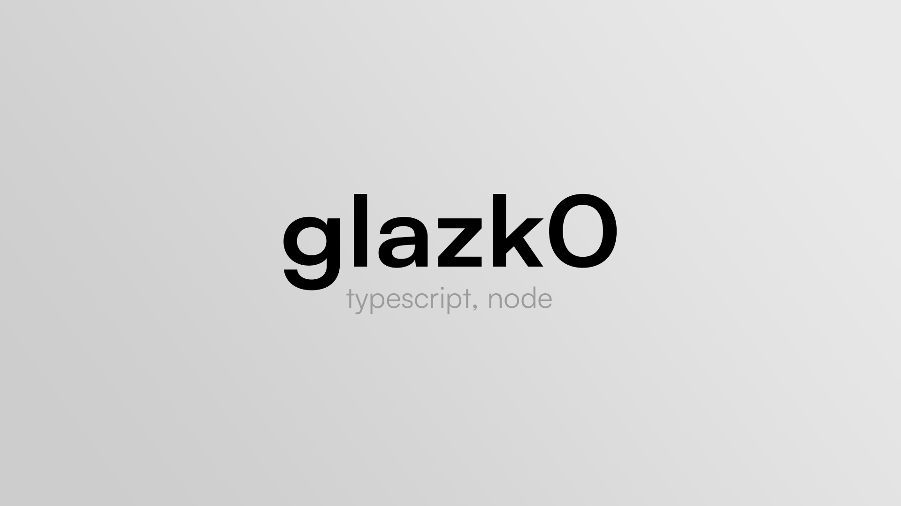

<div align="center">
  <a href="https://glazk0.dev">
    
  </a>
</div>

---

<a href="https://app.daily.dev/get?r=glazk0" target="_blank"></a>

📱 **About me:**

- 😀 I'm **glazk0**, a 19 years old passionate self-taught from Belgium.
- 👨🏽‍💻 I’m currently working on [@Aeternum](https://github.com/AeternumDiscord),
- 🌱 I'm a student pursuing my Bachelor of Software Development,
- 💬 Ask me about anything, I am happy to help,
- 📫 You can reach me [here](https://discord.com/users/247344130798256130);

🚀 **My languages:**

<div align="left">


</div>

💻 **My technologies**

<div align="left">


  


</div>

📊 **Weekly coding time:**

<!--START_SECTION:waka-->

```text
TypeScript   7 hrs 47 mins   ███████████████████░░░░░░   75.35 %
HTML         53 mins         ██░░░░░░░░░░░░░░░░░░░░░░░   08.56 %
CSS          50 mins         ██░░░░░░░░░░░░░░░░░░░░░░░   08.16 %
JSON         25 mins         █░░░░░░░░░░░░░░░░░░░░░░░░   04.11 %
Bash         12 mins         ▓░░░░░░░░░░░░░░░░░░░░░░░░   02.02 %
Other        7 mins          ▒░░░░░░░░░░░░░░░░░░░░░░░░   01.26 %
```

<!--END_SECTION:waka-->

🤜🤛 **Stay connected**

[](https://discord.com/users/247344130798256130)
[](https://twitter.com/glazk0)
[](https://www.linkedin.com/in/th%C3%A9o-go%C3%ABns-016856237/)
